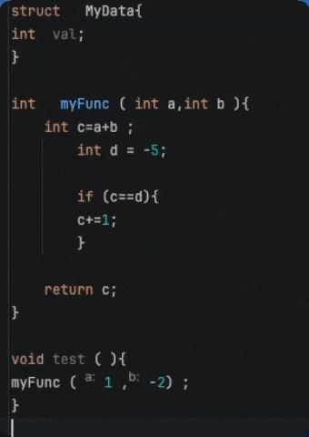
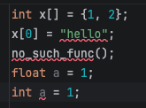
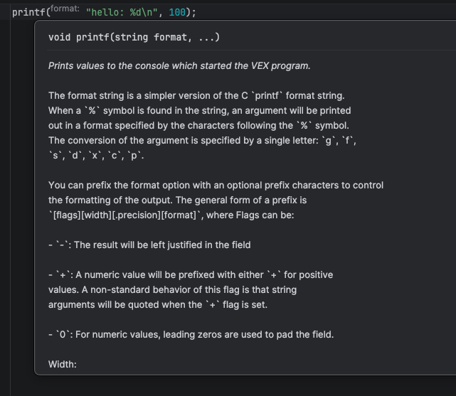
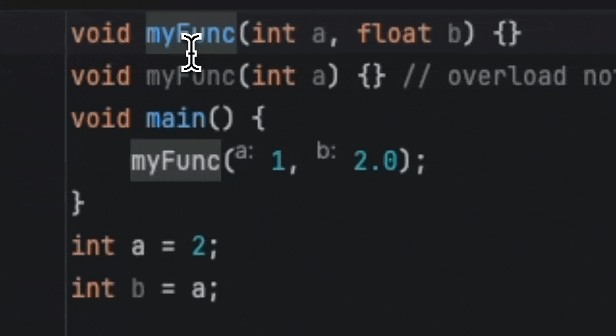
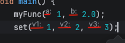
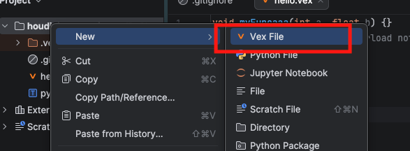

# intellij_vex_plugin

<!-- Plugin description -->
Houdini VEX assyst plugin for JetBrains IDEs (IntelliJ IDEA, PyCharm, WebStorm, etc.)

## Features

* Code Formatting

* Autocomplete

* Error and Warnings (Syntax, Type, etc.)

* Quick Documentation

* Code Navigation / Rename

* Inlay Hints

* Create a new .vex file (Custom templates can be set.)

source code and issue: https://github.com/unclepomedev/intellij_vex_plugin

<!-- Plugin description end -->

